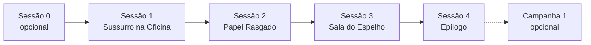

# Mini-campanha — *Patrulha Noturna*

> **Para quem é:** mesa iniciante (Mestre e jogadores de primeira viagem).  
> **Formato:** 3–4 sessões (~2 h cada) · **2 ou 3 jogadores** + 1 mestre · Seq. 9 o tempo todo.  
> **O que você aprende:** arco fechado, investigação, combate curto, digestão e fechamento de caso.

---

## Índice

1. [Visão geral](#visão-geral)
2. [Trilha de jogo](#trilha-de-jogo)
3. [Mesa de 2 ou 3 jogadores](#mesa-de-2-ou-3-jogadores)
4. [Sessão 0 — Antes da primeira noite (opcional)](#sessão-0--antes-da-primeira-noite-opcional)
5. [Sessão 1 — O Sussurro na Oficina](#sessão-1--o-sussurro-na-oficina)
6. [Sessão 2 — O Papel Rasgado](#sessão-2--o-papel-rasgado)
7. [Sessão 3 — A Sala do Espelho](#sessão-3--a-sala-do-espelho)
8. [Sessão 4 — Epílogo e fechamento](#sessão-4--epílogo-e-fechamento)
9. [Folha de cola do Mestre](#folha-de-cola-do-mestre)
10. [Apêndice: NPC aliado (mesa de 2)](#apêndice-npc-aliado-mesa-de-2)

---

## Visão geral

| Item | Detalhe |
|------|---------|
| **Cenário** | Backlund, *East Borough*, 1352 — névoa, lampiões a gás, Águias Noturnas |
| **Tom** | Investigação urbana, horror leve, vitórias pequenas |
| **Vilão** | Pascal “Errata” Wren — intermediário local (Caminho do **Erro**, Seq. 9 **Saqueador**) |
| **Não é** | Aurora Order, Outer Deity, intriga na alta sociedade — isso fica para a Campanha 1 |
| **Duração total** | Sessão 1 (tutorial) + 2–3 sessões novas = **3–4 noites** |

**Premissa do arco:** depois de resolver o caso Morvan, os personagens encontram um símbolo do **Erro** — não do Enforcado. A Capitã Elise pede para rastrear quem vendeu selos corrompidos no bairro. Três noites depois, a célula de Pascal cai; o bairro volta a dormir.



---

## Trilha de jogo

| Ordem | Arquivo | Conteúdo |
|-------|---------|----------|
| 0 (opcional) | Este documento — [Sessão 0](#sessão-0--antes-da-primeira-noite-opcional) | Apresentação do sistema ou criação de ficha |
| 1 | [exemplo-sessao-iniciantes.html](exemplo-sessao-iniciantes.html) | Tutorial completo com rolagens — **use como Sessão 1** |
| 2–4 | Este documento | Continuação do gancho (símbolo do Erro) |

**Personagens:** imprima as **[fichas prontas](pregens/index.html)** (Mara, Tomás, Lídia e Finn para mesa de 2) ou crie com o [Guia de Criação de Ficha](../apendices/guia-criacao-ficha.html). Todos começam e terminam em **Seq. 9**.

| Ficha | Caminho · Seq. 9 | Papel |
|-------|------------------|-------|
| [Mara Silva](pregens/mara-silva.html) | Trevas · Insone | Combate, vigília |
| [Tomás Vargas](pregens/tomas-vargas.html) | Torre Branca · Leitor | Investigação |
| [Lídia Corrêa](pregens/lidia-correa.html) | Eremita · Mistério | Ocultismo |
| [Finn Aldridge](pregens/finn-aldridge.html) | Porta · Aprendiz | NPC aliado (2 PJ) |

---

## Mesa de 2 ou 3 jogadores

### Com 3 jogadores

Use os três pregens do tutorial sem alteração. Cada um cobre um papel:

| PJ | Função na mesa |
|----|----------------|
| **Mara** (Insone) | Vigília, combate, furtividade |
| **Tomás** (Leitor) | Investigação, análise, social |
| **Lídia** (Mistério) | Ocultismo, rituais, percepção espiritual |

### Com 2 jogadores

| Opção | Dupla sugerida | O que falta |
|-------|----------------|-------------|
| **A** | Mara + Tomás | Ocultismo → NPC **Finn** cobre |
| **B** | Tomás + Lídia | Combate → Finn cobre |
| **C** | Mara + Lídia | Investigação social → Finn ou pistas automáticas |

**Regra de ouro (2 PJ):** inclua **Finn Aldridge** (Apêndice) como NPC aliado jogado pelo Mestre — ele acompanha as cenas, não brilha sozinho.

### Escala geral (2 jogadores)

| Situação | Ajuste |
|----------|--------|
| Combate | −1 inimigo fraco por cena; boss perde **25% PV** |
| Investigação | Se falharem por **5+** no teste, Finn ou ambiente entrega pista menor |
| Social | Greta (Sessão 2) aceita suborno mais cedo (5 £ em vez de 10 £) |
| Lucidez | CDs de horror −1 para a mesa |

---

## Sessão 0 — Antes da primeira noite (opcional)

**Duração:** 30–45 min · **sem combate**

### Objetivo

Apresentar o sistema ou criar personagem antes do tutorial.

### Roteiro rápido

1. **5 min** — O que é RPG de mesa; papel do Mestre vs jogador.
2. **10 min** — Mostrar a ficha em branco; explicar atributos 1–5 e `Mod. = Valor − 2`.
3. **15 min** — Criação guiada (use o [Guia de Criação de Ficha](../apendices/guia-criacao-ficha.html)) **ou** distribuir pregens do tutorial.
4. **5 min** — Ler em voz alta o parágrafo de abertura da [Cena 0 do tutorial](exemplo-sessao-iniciantes.html#cena-0--o-mestre-prepara).

### Leia em voz alta

> *Vocês não são heróis de folhetim. São Beyonders de Seq. 9 que a Igreja emprega quando o caso é pequeno demais para um Bispo e grande demais para a polícia. Esta noite, Backlund respira névoa — e alguém no East Borough não está dormindo.*

### Checklist Sessão 0

- [ ] Cada jogador tem ficha (criada ou pregen)
- [ ] Explicou teste `d20 + Mod. Atributo + Mod. Perícia ≥ CD`
- [ ] Explicou Caminho vs Sequência
- [ ] Marcou PV, Espiritualidade e Lucidez na ficha

---

## Sessão 1 — O Sussurro na Oficina

**Não repita este conteúdo aqui** — rode o tutorial completo:

👉 **[exemplo-sessao-iniciantes.html](exemplo-sessao-iniciantes.html)** (~2 h)

### O que precisa acontecer na mesa

| Evento | Por quê |
|--------|---------|
| Morvan preso ou solto (decisão dos jogadores) | Define tom da mesa (rígida vs compassiva) |
| Tomás encontra **papel rasgado** com símbolo do **Erro** | Gancho da Sessão 2 |
| Capitã Elise fecha dossiê Morvan | Transição para novo caso |

### Se não rodou o tutorial

Use o resumo: três crianças sonham “Morvan”; oficina abandonada; selo do Enforcado; Morvan (Suplicante) e Eco de Sussurro derrotados. No epílogo, Tomás acha papel com símbolo que **não** é Enforcado — cheira a **Erro**.

### Entre sessões (recuperação)

| Recurso | Regra simplificada |
|---------|-------------------|
| PV | 1d6 + mod. Vigor por noite de repouso |
| Espiritualidade | 1 h de meditação: recupera metade (arredonda pra cima) |
| Lucidez | Só volta com apoio narrativo (ver Livro do Jogador) |

---

## Sessão 2 — O Papel Rasgado

**Duração:** ~2 h · **Seq. 9** · East Borough

### Resumo

A Capitã Elise não pode escalar o caso Morvan — mas o símbolo no papel é **proibido**. Ela paga 8 libras cada para rastrear quem vendeu “instruções de selo” no mercado de pulgas do *Dockside*. A trilha leva a **Greta Mallows**, banca de livros usados e mapas rabiscados.

```
  TEMPO SUGERIDO (2 h)
  ├─ 15 min │ Cena 1 — Briefing no posto
  ├─ 25 min │ Cena 2 — Mercado de pulgas
  ├─ 25 min │ Cena 3 — A banca da Greta
  ├─ 30 min │ Cena 4 — Emboscada no beco
  └─ 15 min │ Cena 5 — Retorno e pista final
```

---

### Cena 1 — Briefing no posto

**Onde:** quartel das Águias Noturnas — mesma sala do tutorial.

**Leia em voz alta:**

> *A lamparina fumega. Capitã Elise empurra o papel que Tomás guardou — um triângulo partido com linha torta, como um mapa que alguém copiou de memória errada. “Isso não é Enforcado. É **Erro**. Alguém vendeu receita falsa no Dockside. Três dias. Sem manchete. Sem invadir casa de nobre.”*

| NPC | Nota |
|-----|------|
| **Capitã Elise Ward** | Seq. 7; mesma do tutorial; firme, econômica |
| **Finn** (se 2 PJ) | Recruta nervoso; fala pouco, obedece ordens |

**Pagamento prometido:** 8 £ cada + favor registrado (igual ou maior que Morvan, se a mesa foi exemplar).

**O que ensinar:** consequência da Sessão 1 — se soltaram Morvan, Elise menciona desconfiança; se prenderam, elogio seco.

---

### Cena 2 — Mercado de pulgas

**Onde:** *Dockside Flea* — barracas, peixe seco, relógios quebrados, cartomante barulhenta.

**Leia em voz alta:**

> *O cheiro é sal, couro velho e chá barato. Um menino vende fósforos e observa bolsos. Entre barracas de ferragens, uma tenda de lona cinza: **“Greta — Mapas & Curiosidades”**.*

#### Teste 1 — ouvir boatos (opcional)

| | |
|---|---|
| **Teste** | Percepção + Manha (ou Carisma + Empatia) |
| **CD** | 12 |
| **Sucesso** | Ouvem: “A mulher dos mapas vendeu folha para homem de avental manchado de tinta — nome **Pascal**.” |
| **Falha** | Só sabem que a banca existe; Greta está atrás da lona |

**Se travarem:** um mendigo aponta a tenda em troca de 1 xícara de chá (qualquer PJ pode oferecer).

#### Método de Atuação

| Ação coerente | Pontos |
|---------------|--------|
| Tomás anota cada barraca e horário | +8 |
| Mara vigia entradas do mercado | +8 |
| Lídia sente resíduo antes de entrar na tenda (1 Esp.) | +10 |

---

### Cena 3 — A banca da Greta

**NPC: Greta Mallows** — comerciante de meia-idade, olhos rápidos, não é Beyonder.

| | |
|---|---|
| **Motivação** | Medo de Pascal; quer dinheiro |
| **Sabe** | Pascal compra folhas rasgadas de livro antigo; mora perto da **Rua do Tear** (mesma região da oficina) |
| **Não sabe** | Que Pascal é Beyonder |

#### Abordagem social

Jogadores podem persuadir, intimidar ou subornar.

| Abordagem | Teste | CD | Sucesso |
|-----------|-------|-----|---------|
| Persuasão | Carisma + Persuasão | 13 | Ela entrega endereço: **casa 14, Viela do Tear** |
| Intimidação | Carisma + Intimidação | 14 | Entrega endereço; depois denuncia à polícia (−1 favor futuro) |
| Suborno | — | 10 £ | Entrega endereço sem teste |
| Investigação | Int + Investigação | 14 | Acham recibo com “P. Wren” e viela rabiscada |

**Leia em voz alta (sucesso social):**

> *Greta baixa a voz: “Ele não comprou livro — comprou **página**. Dizia que consertava mapas. Pagou em prata. Não quero ver o rosto dele de novo.” Ela escreve: **Viela do Tear, nº 14**.*

#### Se travarem

Finn (ou Elise por mensageiro) menciona que patrulha viu luz estranha na Viela 14 ontem à noite.

---

### Cena 4 — Emboscada no beco

**Gancho:** ao saírem do mercado (ou ao se aproximarem da Viela 14), dois **capangas mundanos** de Pascal tentam recuperar o papel ou intimidar.

| Inimigo | PV | Defesa | Ataque |
|---------|-----|--------|--------|
| Capanga A | 6 | 10 | Faca: d20+1, 1d4+1 |
| Capanga B | 6 | 10 | Faca: d20+1, 1d4+1 |

**Mesa de 2 PJ:** apenas **1 capanga**; o segundo foge se o primeiro cair.

**Tática:** correm se um cair ou se alguém exibir poder Beyonder visível (aura, ritual).

#### Pista no capanga (Investigação CD 12)

Bilhete: *“Leve o papel de volta. — P.”*

### Cena 5 — Retorno e pista final

De volta ao posto (ou direto à Viela 14 se a mesa for agressiva):

**Elise:**

> *“Viela 14. Não invadam até amanhã ao anoitecer — quero vocês descansados. Se Pascal for Beyonder do Erro, ele **quer** que copiem errado. Amanhã fechamos.”*

**Gancho Sessão 3:** à noite, Lídia ou Tomás pode ter visão leve (opcional): espelho rachado refletindo três rostos que não são os de vocês. Teste Percepção Espiritual CD 11 — sucesso confirma **ritual incompleto** na casa 14.

### Checklist Sessão 2

- [ ] Cada PJ rolou pelo menos um teste social ou investigação
- [ ] Houve combate curto ou ameaça física
- [ ] Endereço da Viela 14 obtido
- [ ] Pontos de digestão marcados por atuação

---

## Sessão 3 — A Sala do Espelho

**Duração:** ~2 h · **Seq. 9** · Viela do Tear, nº 14

### Resumo

Casa estreita de dois andares. No andar de cima, **Pascal “Errata” Wren** mantém um **espelho rachado** como foco de ritual: copia selos de outros Caminhos **de propósito errado**, vende as folhas e alimenta um **Eco de Distorção**. Os jogadores invadem ao anoitecer (com ou sem ordem de Elise — se invadirem cedo, Elise desaprova mas não aborta).

```
  TEMPO SUGERIDO (2 h)
  ├─ 15 min │ Cena 1 — Entrada na casa
  ├─ 25 min │ Cena 2 — Sala do espelho (puzzle)
  ├─ 35 min │ Cena 3 — Confronto com Pascal
  └─ 15 min │ Cena 4 — Rescaldo imediato
```

---

### Cena 1 — Entrada na casa

**Leia em voz alta:**

> *A casa 14 range como dente solto. Cheiro de tinta e poeira de giz. No corredor, mapas rasgados cobrem pregos tortos — cada um com linha **quase** certa, mas nunca fechando o círculo.*

#### Teste — entrar em silêncio

| | |
|---|---|
| **Teste** | Destreza + Furtividade (quem liderar) |
| **CD** | 13 |
| **Sucesso** | Surpresa parcial no confronto (+ vantagem na 1ª rodada) |
| **Falha** | Pascal ouve; Eco flutua no corredor |

**Lídia — Ver Auras (1 Esp.):** resíduo **amarelo-acinzentado**, seco — Caminho do **Erro**.

**Se travarem:** barulho de vidro quebrando no andar de cima (Pascal quebra frasco por nervosismo) — pista audível.

---

### Cena 2 — Sala do espelho (puzzle)

**Onde:** andar superior — uma cadeira, mesa com tinta, **espelho rachado** em moldura negra, três velas apagadas.

#### O puzzle (sem combate ainda)

O espelho mostra **três reflexos errados** (rostos de vítimas do bairro, incluindo criança do caso Morvan). Para desarmar o ritual incompleto:

| Passo | Ação | Teste | CD |
|-------|------|-------|-----|
| 1 | Identificar que o espelho é foco | Int + Ocultismo ou Percepção Espiritual | 12 |
| 2 | Cobrir espelho com pano **ou** apagar runas na moldura | Destreza + Ritualismo ou Int + Ocultismo | 13 |
| 3 | Recitar inversão simples (Lídia ou Tomás lê frase na parede) | Determinação + Ocultismo | 12 |

**Frase na parede (leia se alguém investigar):**

> *“O que foi copiado errado deve ser nomeado certo.”*

**Nome certo:** jogador deve dizer o **Caminho verdadeiro** do selo corrompido — **Enforcado** (do caso Morvan). Acertar sem teste se já jogaram Sessão 1.

| Resultado | Efeito |
|-----------|--------|
| 3 passos OK | Eco de Distorção perde metade dos PV; Pascal perde 1 ação na 1ª rodada |
| 2 passos OK | Eco com PV normal |
| Falha geral | Eco ataca durante o puzzle (1d4 Lucidez CD 12 para quem olhar espelho) |

**Tomás — Análise Situacional (1 Esp.):** “Pascal precisa do espelho — quebrá-lo enfurece-o mas encerra o ritual.”

---

### Cena 3 — Confronto com Pascal

**Pascal “Errata” Wren** surge da escada — avental de tinta, sorriso cansado.

**Leia em voz alta:**

> *“Vocês copiaram o endereço certo.” Ele toca o espelho. “Eu só vendo **erros**. O mundo já está errado — eu facilito.”*

#### Estatísticas — Pascal Wren

| | |
|---|---|
| **Caminho** | Erro · **Saqueador** (Seq. 9) |
| **PV** | 12 (9 com 2 PJ) |
| **Defesa** | 11 |
| **Iniciativa** | +1 |
| **Espiritualidade** | 5 |

| Ataque | Detalhe |
|--------|---------|
| **Faca de gravura** | d20+1, 1d4+1 dano |
| **Selo Errado** (1 Esp., 1×/cena) | Alvo faz Salvaguarda Mente CD 13 ou −1 em todos os testes por 1 rodada |

**Poder passivo — Copista Falho:** quando Pascal acerta ataque, pode “deslocar” 1 ponto de dano para o espelho (ritual absorve; se espelho já coberto, sem efeito).

#### Eco de Distorção

| | |
|---|---|
| **PV** | 4 (3 com 2 PJ) |
| **Defesa** | 12 |
| **Ataque** | Toque distorcido: Salvaguarda Espírito CD 12 ou −1 Lucidez |
| **Fraqueza** | Espelho coberto ou runas apagadas — Eco perde 2 PV/rodada |

#### Mapa simples

```
  [ESCADA]
      │
  [MESA + VELAS]──── Pascal
      │
  [ESPELHO]──── Eco
```

#### Táticas de Pascal

1. Fica perto do espelho; usa Selo Errado no investigador.
2. Se espelho for coberto, tenta fugir pela janela (Atletismo CD 13 para escapar).
3. Não luta até a morte se espelho quebrado — rendição possível.

#### Rendição (roleplay)

> *“Tudo que vendi… já estava rasgado. Eu só organizei o caos.”*

| Decisão | Consequência |
|---------|--------------|
| Entregam às Águias | +favor Elise; Pascal preso |
| Quebram espelho e o soltam | Ele foge do bairro; caso fechado, −2 favor |
| Matam | Teste Perda de Lucidez CD 13 para quem matou |

**Mesa de 2 PJ:** Finn ajuda em combate (1 ataque por rodada, d20+0, 1d4) — não precisa fichar além disso.

---

### Cena 4 — Rescaldo imediato

- Espelho coberto ou quebrado → crianças do bairro dormem melhor (notícia na Sessão 4).
- Papelada de Pascal: lista de três compradores — só um nome legível: **“Oficina — M.”** (Morvan, retroativo; fecha o arco).
- Loot: 15 £ divididos, frasco de tinta ritual (componente menor), mapa do Dockside.

### Checklist Sessão 3

- [ ] Puzzle do espelho resolvido (total ou parcial)
- [ ] Alguém gastou Espiritualidade
- [ ] Combate ou rendição concluídos
- [ ] Decisão moral sobre Pascal tomada

---

## Sessão 4 — Epílogo e fechamento

**Duração:** 45–60 min · pode ser curta · **sem combate obrigatório**

### Cena 1 — De volta às Águias Noturnas

**Leia em voz alta:**

> *O corredor do posto cheira a chá forte de novo. Pela janela, o East Borough parece igual — mas Milo (a criança do caso Morvan) dorme com o rosto relaxado pela primeira vez em semanas.*

**Capitã Elise:**

| Resultado da mesa | Fala de Elise |
|-------------------|---------------|
| Pascal preso + espelho destruído | “Trabalho limpo. Não é manchete — é **silêncio**. Isso paga as contas.” |
| Pascal fugiu | “O bairro respira. O homem não. Anotado.” |
| Morvan + Pascal ambos presos | “Dois casos pequenos. Um arranhão no mapa maior. Descansem.” |

**Pagamento final:** 8 £ cada (Sessão 2) + 7 £ cada (Sessão 3) = **15 £ total** no arco (além dos 5 £ do tutorial).

### Digestão e progressão

| Marco | Pontos sugeridos (total do arco) |
|-------|----------------------------------|
| Atuação coerente em cada sessão | 8–12 por sessão |
| Fechar caso sem manchete | +10 grupo |
| Decisão moral discutida em mesa | +5 |

Ninguém sobe para Seq. 8 neste arco — é normal. Mostre a barra 20–40% preenchida.

### Recuperação final

Uma semana narrativa de descanso: PV e Espiritualidade cheios; Lucidez recupera 1 ponto se a mesa teve cena de apoio entre si.

### Ganchos opcionais (pós-arco)

| Gancho | Para onde |
|--------|-----------|
| Elise menciona “caso #217” — corpos com alma dilacerada | [Campanha 1 — Sombras sobre Backlund](01-sombras-backlund.html) |
| Greta desaparece do mercado | Mistério lateral; ignore se a mesa não quiser |
| Símbolo do Erro aparece em jornal classificado | Tomás ganha contato no *Observer* |

**Leia em voz alta (fechamento):**

> *A névoa engole o fim da rua. Vocês ainda são Seq. 9 — ferramentas úteis, não lendas. Mas três noites seguidas, o East Borough dormiu. E isso, nesta cidade, já é vitória.*

### Checklist Sessão 4

- [ ] Recompensas e consequências narradas
- [ ] Digestão atualizada
- [ ] Perguntou se a mesa quer continuar
- [ ] Celebrou o que cada PJ fez bem

---

## Folha de cola do Mestre

### CDs desta mini-campanha

| Situação | CD |
|----------|-----|
| Boatos no mercado | 12 |
| Persuadir Greta | 13 |
| Intimidar Greta | 14 |
| Investigação recibo | 14 |
| Furtividade casa 14 | 13 |
| Puzzle espelho (cada passo) | 12–13 |
| Salvaguardas Pascal / Eco | 12–13 |
| Fuga Pascal (janela) | 13 |

### NPCs principais

| NPC | Papel | Nota |
|-----|-------|------|
| Capitã Elise Ward | Patrona | Seq. 7; mesma do tutorial |
| Greta Mallows | Informante | Mundana; medo de Pascal |
| Pascal Wren | Antagonista | Erro · Saqueador · Seq. 9 |
| Eco de Distorção | Criatura | Ligado ao espelho |
| Finn Aldridge | Aliado (2 PJ) | Ver Apêndice |

### Regras de ouro para Mestre iniciante

1. **Falha avança** — sempre dê pista menor ou custo narrativo, nunca parede.
2. **Um combate por sessão** basta neste arco.
3. **Leia em voz alta** os blocos cinza; improvise o resto.
4. **Não explique lore cósmico** — Pascal é criminoso local, não profeta.
5. **Celebre** quando jogadores cooperam (Mara vigia, Tomás analisa, Lídia sente).

### Onde ler regras completas

| Tema | Arquivo |
|------|---------|
| Criação de ficha | `apendices/guia-criacao-ficha.html` |
| Tutorial (Sessão 1) | `campanhas/exemplo-sessao-iniciantes.html` |
| Testes e atributos | `livro-jogador/03-atributos.html` |
| Poderes Seq. 9 | `livro-jogador/05-sequencias.html` |
| Método de Atuação | `livro-jogador/06-atuacao.html` |
| Campanha longa (depois) | `campanhas/01-sombras-backlund.html` |

---

## Apêndice: NPC aliado (mesa de 2)

Use **Finn Aldridge** quando só houver dois jogadores. O Mestre controla Finn — ele **apoia**, não resolve cenas sozinho.

### Finn Aldridge — Aprendiz (Porta · Seq. 9)

| | |
|---|---|
| **Conceito** | Recruta das Águias Noturnas; carrega lanterna e bandagens |
| **Atuação** | *Abra caminhos — literalmente e figurativamente* |
| **Posição** | **Ereta** |

**Atributos**

| Físico | | Social | | Mental | |
|--------|--|--------|--|--------|--|
| Força 2 | +0 | Carisma 2 | +0 | Percepção 2 | +0 |
| Destreza 2 | +0 | Manipulação 2 | +0 | Inteligência 2 | +0 |
| Vigor 3 | +1 | Aparência 2 | +0 | Determinação 3 | +1 |

**Perícias:** Medicina 2 (+0) · Atletismo 2 (+0) · Luta 1 (−1) · Ocultismo 1 (−1)

| Derivado | Valor |
|----------|-------|
| **PV** | 9 |
| **Espiritualidade** | 5 |
| **Lucidez** | 6 |
| **Defesa** | 10 |

**Poderes Seq. 9 (Porta)**

| Poder | Custo | Uso na mesa |
|-------|-------|-------------|
| Chave Universal | 1 Esp. | Abre fechadura simples (oficina, casa 14) — 1×/cena |
| Barreira Menor | 1 Esp. | +1 Defesa aliado adjacente por 1 rodada |
| Sentido de Limiar | — | Sente “portas” ocultas; +1 Investigação em alçapões |

**Em combate:** 1 ataque simples por rodada (d20+0, 1d4). Priorize **Barreira Menor** no PJ mais exposto.

**Em investigação:** Chave Universal evita travar a mesa sem ladrão na dupla.

---

*Senhor dos Mistérios RPG — mini-campanha didática. Derivado da obra de Cuttlefish That Loves Diving.*
