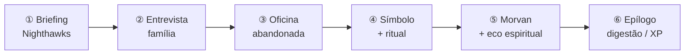

# Exemplo de sessão — *O Sussurro na Oficina*

> **Para quem é:** jogadores e mestres que nunca rodaram *Senhor dos Mistérios RPG*.  
> **Formato:** 1 sessão (~2 h) · 3 jogadores + 1 mestre · personagens prontos (Seq. 9).  
> **O que você aprende:** testes d20, poderes, Espiritualidade, Lucidez, Método de Atuação e ritmo de investigação.

---

## Índice

1. [Resumo da mesa](#resumo-da-mesa)
2. [Fluxo da sessão (mapa)](#fluxo-da-sessão-mapa)
3. [Personagens prontos](#personagens-prontos)
4. [Cena 0 — O Mestre prepara](#cena-0--o-mestre-prepara)
5. [Cena 1 — Briefing (sem dados)](#cena-1--briefing-sem-dados)
6. [Cena 2 — A mãe e o sonho](#cena-2--a-mãe-e-o-sonho)
7. [Cena 3 — Rastros na oficina](#cena-3--rastros-na-oficina)
8. [Cena 4 — O símbolo na parede](#cena-4--o-símbolo-na-parede)
9. [Cena 5 — Confronto com Morvan](#cena-5--confronto-com-morvan)
10. [Cena 6 — Epílogo e recompensas](#cena-6--epílogo-e-recompensas)
11. [Folha de cola do Mestre](#folha-de-cola-do-mestre)

---

## Resumo da mesa

| Papel | Nome real | Personagem | Caminho · Seq. 9 |
|-------|-----------|------------|------------------|
| **Mestre** | Adriano | — | Narra Backlund, NPCs, CDs |
| **Jogador 1** | Beatriz | **Mara Silva** | Trevas · **Insone** |
| **Jogador 2** | Caio | **Tomás Vargas** | Torre Branca · **Leitor** |
| **Jogador 3** | Diana | **Lídia Corrêa** | Eremita · **Mistério** |

**Premissa:** crianças do *East Borough* acordam exaustas, murmurando o mesmo nome — **Morvan**. As **Águias Noturnas** contratam três Beyonders de Seq. 9 como reforço por uma noite.

**Tom:** investigação urbana, névoa, lampiões a gás, horror leve (nada gráfico demais para a primeira sessão).

---

## Fluxo da sessão (mapa)



```
  TEMPO SUGERIDO (2 h)
  ├─ 15 min │ Cena 1 — Briefing + apresentação dos PJs
  ├─ 20 min │ Cena 2 — Roleplay social + 1–2 testes
  ├─ 25 min │ Cena 3 — Investigação na oficina
  ├─ 20 min │ Cena 4 — Ocultismo + poderes Beyonder
  ├─ 30 min │ Cena 5 — Confronto
  └─ 10 min │ Cena 6 — Fechamento e ensino das regras
```

---

## Personagens prontos

### Regra rápida de teste (use em toda a sessão)

```
d20 + Mod. Atributo + Mod. Perícia  ≥  CD  →  sucesso
```

| CD | Dificuldade |
|----|-------------|
| 10 | Fácil |
| 13 | Média |
| 15 | Difícil |
| 18 | Muito difícil |

**Modificador** = valor do atributo ou perícia **− 2** (escala 1–5).

---

### Mara Silva — Insone (Águias Noturnas auxiliar)

| | |
|---|---|
| **Conceito** | Ex-patrulheira de rua que não dorme mais; vigia o bairro |
| **Atuação (Seq. 9)** | *Nunca durma — vigie enquanto o mundo descansa* |
| **Posição** | **Ereta** (protege inocentes) |

**Atributos**

| Físico | | Social | | Mental | |
|--------|--|--------|--|--------|--|
| Força 2 | +0 | Carisma 2 | +0 | Percepção 4 | +2 |
| Destreza 3 | +1 | Manipulação 2 | +0 | Inteligência 2 | +0 |
| Vigor 3 | +1 | Aparência 2 | +0 | Determinação 4 | +2 |

**Perícias:** Furtividade 3 (+1) · Investigação 2 (+0) · Armas Leves 2 (+0) · Ocultismo 1 (−1)

| Derivado | Valor |
|----------|-------|
| **PV** | 9 (8 + Vigor + Seq 9) |
| **Espiritualidade** | 8 (Percepção + Determinação) |
| **Lucidez** | 7 (5 + mod. Determinação) |
| **Iniciativa** | +2 (+1 Dest + bônus Vigília Incansável) |

**Poderes Seq. 9**

| Poder | Custo | Efeito resumido |
|-------|-------|-----------------|
| Visão Noturna Aprimorada | — | Vê no escuro; +2 Percepção à noite |
| Vigília Incansável | — | 2 h meditação = descanso; +1 Iniciativa |
| Sentido de Perigo | 1 Esp. | Reação: +3 Defesa ou Vantagem em salvaguarda |

---

### Tomás Vargas — Leitor (jornalista freelancer)

| | |
|---|---|
| **Conceito** | Repórter do *Backlund Observer* que “leu demais” |
| **Atuação** | *Leia tudo, memorize tudo, analise tudo* |
| **Posição** | **Ereta** (busca a verdade para publicar) |

**Atributos**

| Físico | | Social | | Mental | |
|--------|--|--------|--|--------|--|
| Força 2 | +0 | Carisma 3 | +1 | Percepção 3 | +1 |
| Destreza 2 | +0 | Manipulação 3 | +1 | Inteligência 4 | +2 |
| Vigor 2 | +0 | Aparência 2 | +0 | Determinação 3 | +1 |

**Perícias:** Investigação 4 (+2) · Ciências 2 (+0) · Empatia 2 (+0) · Furtividade 1 (−1)

| Derivado | Valor |
|----------|-------|
| **PV** | 8 |
| **Espiritualidade** | 6 |
| **Lucidez** | 6 |

**Poderes Seq. 9**

| Poder | Custo | Efeito resumido |
|-------|-------|-----------------|
| Memória Perfeita | — | +2 Int + Investigação / História / Ciências |
| Leitura Rápida | 1 Esp. | Livro inteiro em 1 min |
| Análise Situacional | 1 Esp. | Narrador revela 1 fato não óbvio (2×/cena) |

---

### Lídia Corrêa — Mistério (ervanária do bairro)

| | |
|---|---|
| **Conceito** | Curandeira que sente “cheiro” de magia errada |
| **Atuação** | *Investigue o oculto; nunca aceite a primeira resposta* |
| **Posição** | **Ereta** |

**Atributos**

| Físico | | Social | | Mental | |
|--------|--|--------|--|--------|--|
| Força 2 | +0 | Carisma 2 | +0 | Percepção 3 | +1 |
| Destreza 2 | +0 | Manipulação 2 | +0 | Inteligência 3 | +1 |
| Vigor 2 | +0 | Aparência 3 | +0 | Determinação 3 | +1 |

**Perícias:** Ocultismo 3 (+1) · Ritualismo 2 (+0) · Medicina 2 (+0) · Investigação 2 (+0)

| Derivado | Valor |
|----------|-------|
| **PV** | 8 |
| **Espiritualidade** | 6 |
| **Lucidez** | 6 |

**Poderes Seq. 9**

| Poder | Custo | Efeito resumido |
|-------|-------|-----------------|
| Ver Auras Místicas | 1 Esp. | Detecta magia/resíduo por 10 min |
| Ritual Básico | 2 Esp. | Proteção, purificação ou consagração (10 min) |
| Leitura de Símbolos | 1 Esp. | Entende selo ao tocar |

---

## Cena 0 — O Mestre prepara

**Leia em voz alta (opcional):**

> *Backlund, 1352 da Quinta Época. A névoa industrial cola nos casacos. Vocês três não são heróis de folhetim — são ferramentas úteis que a Igreja da Deusa da Noite emprega quando o caso é pequeno demais para um Bispo e grande demais para a polícia comum.*

**NPC principal**

| NPC | Papel | Seq. | Nota |
|-----|-------|------|------|
| **Capitã Elise Ward** | Águia Noturna | 7 | Firme, econômica nas palavras |
| **Morvan Ketch** | Antagonista | 9 Suplicante | Ex-operário; ouve “vozes” no Enforcado |
| **Eco de Sussurro** | Criatura | — | 2 PV, ligado a selo rasgado |

**Mapa mental do local**

```
     RUA DO Tear
          │
    ┌─────┴─────┐
    │  Viela 7  │──► Casa da Sra. Holt (criança: Milo)
    └─────┬─────┘
          │
    ┌─────▼──────────────┐
    │ OFICINA TEXTIL     │  ← símbolo na parede do porão
    │ (abandonada)       │  ← Morvan no porão
    └────────────────────┘
```

---

## Cena 1 — Briefing (sem dados)

**Onde:** posto das Águias Noturnas, *East Borough* — sala com mapa, lamparina a óleo, cheiro de chá forte.

**Capitã Elise (Mestre):**

> “Três crianças, três noites, o mesmo nome ao acordar: **Morvan**. Nenhuma ferida física. Padre local fala em pesadelo comum. Eu não gosto de coincidência. Vocês entram, investigam, **não** fazem manchete. Se encontrarem Beyonder descontrolado — contêm ou tragam prova. Pagamento: 5 libras cada + um favor registrado.”

### O que ensinar aqui

| Conceito | Como explicar em 1 frase |
|----------|---------------------------|
| **Papel do Mestre** | Descreve o mundo; os jogadores decidem o que fazer. |
| **Papel do jogador** | Só controla o próprio personagem; diz intenções, não roteiro. |
| **Caminho vs Sequência** | Mara é **Insone** (nome da Seq. 9), não “caminho Insone”. Caminho dela: **Trevas**. |

**Pergunta comum de iniciante**

| Jogador pergunta | Resposta do Mestre |
|------------------|-------------------|
| “Posso usar magia agora?” | “Você já é Beyonder Seq. 9. Seus poderes estão na ficha; cada um custa **Espiritualidade**.” |
| “A igreja confia em nós?” | “Confia o suficiente para gastar vocês. Não o suficiente para dar Seq. 8.” |

---

## Cena 2 — A mãe e o sonho

**Onde:** apartamento apertado da **Sra. Holt** — Milo (8 anos) pálido, olheiras.

### Roleplay livre (sem dados)

Jogadores podem acalmar a mãe, observar o quarto, perguntar sobre Morvan (vizinho que perdeu o emprego na fábrica).

### Teste 1 — ganhar confiança (opcional)

| | |
|---|---|
| **Quem** | Quem liderar a conversa |
| **Teste** | Carisma + Empatia |
| **CD** | 12 |
| **Sucesso** | Ela revela: Morvan foi visto **riscando algo** na oficina há três noites |
| **Falha** | Ela só repete “é maldição da fábrica” |

**Exemplo de rolagem (Beatriz / Mara):**

| d20 | + Car | + Perícia | = Total | CD | Resultado |
|-----|-------|-----------|---------|-----|-----------|
| 11 | +0 | +0 | **11** | 12 | Falha por 1 — Mara é seca demais |

**Tomás tenta de novo (Caio):**

| d20 | + Car | + Empatia | = Total | CD | Resultado |
|-----|-------|-----------|---------|-----|-----------|
| 14 | +1 | +0 | **15** | 12 | **Sucesso** — Holt desenha mapa da viela até a oficina |

> **Ensino:** falhar não trava a cena; muda *como* vocês aprendem (mapa vs. boatos).

### Método de Atuação (primeiro ponto)

Se **Tomás** disser que anota cada detalhe num caderno e cruza horários dos sonhos:

| Ação de atuação | Pontos de digestão |
|-----------------|-------------------|
| Interpretou Leitor de forma clara | **+10** (Mestre marca na ficha) |

```
  Digestão Tomás:  [████░░░░░░] 10 / 100
```

---

## Cena 3 — Rastros na oficina

**Onde:** oficina têxtil fechada — portas trancadas, cheiro de mofo e óleo de máquina.

### Divisão de tarefas (mesa cooperativa)

```
        ┌─────────────────────────────────┐
        │         OFICINA               │
        │  Mara ──► patrulha externa    │
        │  Tomás ──► registra evidências │
        │  Lídia ──► sente resíduo mágico│
        └─────────────────────────────────┘
```

### Teste 2 — entrar sem alarde

| | |
|---|---|
| **Mara** | Destreza + Furtividade |
| **CD** | 13 |
| **Sucesso** | Abre janela lateral sem quebrar vidro |
| **Falha** | Vidro estala — **Morvan** ganha +2 na próxima emboscada |

**Rolagem Mara:**

| d20 | + Dest | + Furt. | = | CD |
|-----|--------|---------|---|-----|
| 16 | +1 | +1 | **18** | 13 ✓ |

### Teste 3 — encontrar o porão

| | |
|---|---|
| **Tomás** | Inteligência + Investigação (+2 Memória Perfeita) |
| **CD** | 14 |
| **Sucesso** | Plano de chão mostra alçapão sob tear caído |
| **Falha** | Perdem 10 min; Lídia gasta 1 Esp. em **Auras** e sente frio vindo do chão |

**Rolagem Tomás (com bônus do poder):**

| d20 | + Int | + Invest. | + poder | = | CD |
|-----|-------|-----------|---------|---|-----|
| 8 | +2 | +2 | +2 | **14** | 14 ✓ (no limite) |

### Poder em cena — Lídia

**Ver Auras Místicas** (1 Espiritualidade):

> O Mestre descreve: *uma névoa violeta-fraca sob as tábuas, “sabor” de segredo e sombra — Caminho do **Enforcado**, resíduo fraco.*

| Esp. antes | Gasto | Esp. depois |
|------------|-------|-------------|
| 6 | 1 | **5** |

---

## Cena 4 — O símbolo na parede

**Onde:** porão — lamparina apagada, **símbolo** riscado em carvão: círculo partido com olho ao centro.

### Leitura de Símbolos (Lídia)

Gasta **1 Esp.** — sucesso automático para significado básico:

> “Selo de **contenção de sonhos**, mal copiado. Quem usa isso **rouba** descanso alheio para alimentar um eco espiritual.”

| Teste extra (opcional) | Int + Ocultismo | CD 15 |
|------------------------|-----------------|-------|
| Sucesso | Sabe que rasgar o selo liberta o eco — e enfurece o criador |
| Falha | Só sentem perigo vago |

**Tomás — Análise Situacional** (1 Esp., ação bônus):

> Mestre revela: *há pegadas frescas de botas baratas saindo por trilho de carvão — alguém esteve aqui há menos de uma hora.*

### Mara — vigília (Atuação)

Mara declara: *“Fico na escuridão do topo da escada; ninguém nos surpreende.”*

| Digestão Mara | +8 (ação coerente com Insone, risco médio) |
|---------------|---------------------------------------------|

---

## Cena 5 — Confronto com Morvan

**Gancho:** **Morvan Ketch** surge da sombra do tear — olhos injetados, sussurra frases do Enforcado. Um **Eco de Sussurro** (névoa com rosto de criança) flutua sobre o selo rasgado.

### Iniciativa

| Personagem | d20 + Inic. | Ordem |
|------------|-------------|-------|
| Mara | 15 +2 = **17** | 1º |
| Eco | 12 | 2º |
| Tomás | 9 +0 = 9 | 3º |
| Morvan | 8 +0 = 8 | 4º |
| Lídia | 7 +0 = 7 | 5º |

### Mapa de combate (simples)

```
  [ESCADA]─── Mara
       │
  [TEAR]──── Morvan + Eco
       │
  [SELO]──── Lídia / Tomás
```

### Rodada 1 — exemplo completo

**Mara** — ataca Morvan com revólver (Armas Leves):

| d20 | + Dest | + Armas | = | CD Defesa Morvan (13) |
|-----|--------|---------|---|------------------------|
| 13 | +1 | +0 | **14** | ✓ acerto |

**Dano:** 1d6 + mod. Destreza → rola **4** +1 = **5 PV** em Morvan (ele tem 8 PV).

**Morvan** — gesto desesperado; Eco ataca mente de Tomás:

| Salvaguarda | Determinação + Ocultismo (Tomás) | CD 13 |
|-------------|-----------------------------------|-------|
| d20 11 +1 +0 = 12 | | **Falha** |

> Tomás ouve o próprio nome sussurrado em voz de criança. **−1 Lucidez** (teste de horror leve).

| Lucidez Tomás | 6 → **5** |

**Lídia** — **Ritual Básico: proteção** (2 Esp., 10 min narrados como versão “apressada” na mesa: Mestre reduz para 1 rodada em tutorial = **consagração emergencial** house-rule **ou** espera 2 rodadas; para ensino, diga: “vocês protegem Tomás na próxima rodada”).

**Ensino:** rituais demoram; em combate, posicionem-se.

### Rodada 2

**Eco** ataca Mara — ela usa **Sentido de Perigo** (1 Esp., reação):

| | |
|---|---|
| Efeito | +3 Defesa |
| Ataque Eco vs Defesa 15+3=18 | d20 ataque 14 — **erra** |

**Tomás** — não luta bem; usa **Análise Situacional**:

> “O Eco está preso ao selo — destruir o carvão no chão o enfraquece.”

**Mara** — arranca lamparina, joga fogo no **carvão do símbolo** (ação narrativa + teste Destreza CD 11 — sucesso).

**Eco** dissolve-se com um suspiro. **Morvan** cai de joelhos, chorando.

### Morvan derrotado (roleplay)

Morvan não é vilão de campanha inteira — está quebrado:

> “Eu só queria dormir… a voz disse que se eu pegasse o sono dos outros, eu descansaria…”

| Decisão dos jogadores | Consequência |
|-----------------------|--------------|
| Entregam às Águias Noturnas | +favor com Elise; Morvan preso |
| Curam e soltam | +compaixão; Elise desaprova (−1 reputação) |
| Matam | Teste **Perda de Lucidez** CD 14 para quem puxou o gatilho |

---

## Cena 6 — Epílogo e recompensas

**De volta ao posto — Capitã Elise:**

> “Três crianças dormiram. Não é manchete. É trabalho.” — entrega **5 libras** cada.

### Tabela de aprendizado pós-sessão

| Mecânica | O que aconteceu na mesa |
|----------|-------------------------|
| **Teste d20** | Empatia, Furtividade, Investigação |
| **Poderes** | Auras, Análise, Sentido de Perigo, Ritual |
| **Espiritualidade** | Gastou e precisa descansar / ritual para recuperar |
| **Lucidez** | Tomás perdeu 1 por horror |
| **Digestão** | Tomás +10, Mara +8 — longe de Seq. 8 |
| **Cooperação** | Cada PJ fez uma função diferente |

### Recuperação (entre sessões)

| Recurso | Regra simplificada ensinada |
|---------|----------------------------|
| PV | 1d6 + mod. Vigor por noite de repouso |
| Espiritualidade | Meditação 1 h: recupera metade (arredonda pra cima) |
| Lucidez | Não volta sozinha — precisa de cena de apoio ou terapia (ver Livro do Jogador) |

### Gancho para continuar (opcional)

> Na gola do casaco de Morvan, Tomás encontra pedaço de papel com símbolo **diferente** — não Enforcado: cheira a **Erro** (Amon?). Capitã Elise fecha o dossiê: “Acima do nosso pagamento.”

**Continuar o arco:** esta sessão é a **Sessão 1** da mini-campanha [Patrulha Noturna](00-patrulha-noturna.html) (Sessões 2–4: mercado de pulgas, sala do espelho, epílogo).

---

## Folha de cola do Mestre

### CDs desta sessão

| Situação | CD |
|----------|-----|
| Empatia com Sra. Holt | 12 |
| Furtividade na oficina | 13 |
| Investigação alçapão | 14 |
| Ocultismo selo avançado | 15 |
| Defesa de Morvan | 13 |
| Salvaguarda Eco (mental) | 13 |

### Morvan Ketch (estatísticas rápidas)

| | |
|---|---|
| **Seq. 9** | Suplicante (Enforcado) — 8 PV |
| **Ataque** | Sussurro: Int+Ocultismo vs Det+Ocultismo, 1d4 dano espiritual + teste Lucidez CD 12 |
| **Tática** | Esconde-se; deixa Eco atacar; foge se selo for destruído |

### Eco de Sussurro

| PV | 2 |
|----|---|
| **Ataque** | CD 13 mental, 1 Lucidez se falhar |
| **Fraqueza** | Destruir carvão do selo na parede |

### Checklist “primeira sessão”

- [ ] Cada jogador rolou pelo menos **um d20**
- [ ] Alguém gastou **Espiritualidade**
- [ ] Alguém ganhou **pontos de digestão** por atuação
- [ ] Explicou diferença **Caminho / Sequência**
- [ ] Mostrou que **falha avança** a história

### Onde ler as regras completas

| Tema | Arquivo |
|------|---------|
| Testes e atributos | `livro-jogador/03-atributos.html` |
| Poderes Seq. 9 | `livro-jogador/05-sequencias.html` |
| Método de Atuação | `livro-jogador/06-atuacao.html` |
| Campanha longa similar | `campanhas/01-sombras-backlund.html` |
| 22 Caminhos (Mestre) | `livro-mestre/guia-22-caminhos-deuses.html` |

---

## Transcrição curta (como soa na mesa)

> **Mestre:** A névoa engole o fim da rua. O letreiro da oficina rangueja. O que vocês fazem?  
> **Beatriz (Mara):** Circundo pelo beco e entro pela janela — estou acostumada com escuro.  
> **Mestre:** Rola Destreza + Furtividade contra CD 13.  
> **Beatriz:** Dezesseis mais um mais um — dezoito!  
> **Caio (Tomás):** Enquanto isso, procuro planta da fábrica ou diário de turno.  
> **Diana (Lídia):** Antes de descer, gasto um ponto e **vejo auras** no chão.  
> **Mestre:** Perfeito. Mara, você está dentro. Tomás, Investigação. Lídia, violeta-fraca — Enforcado. E todos ouvem, lá embaixo, uma respiração que não é só uma.

---

*Senhor dos Mistérios RPG — exemplo didático. Derivado da obra de Cuttlefish That Loves Diving.*
