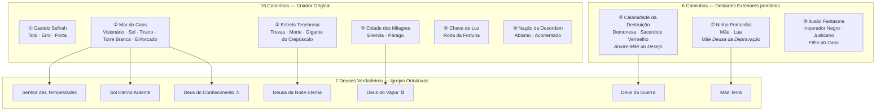
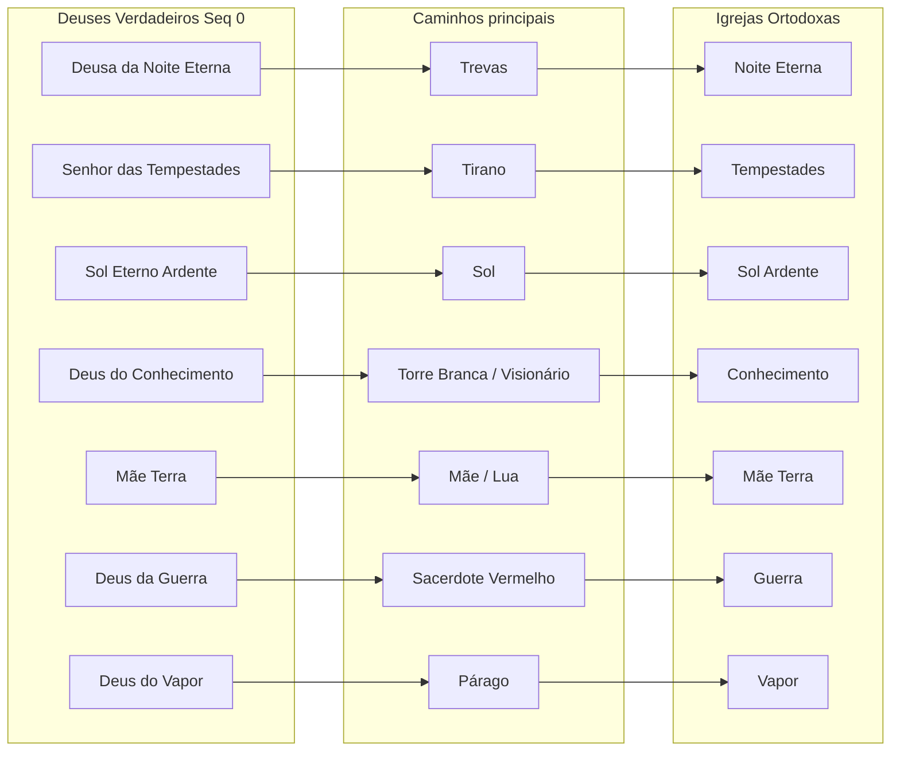

# Guia rápido do Mestre — 22 Caminhos, Sefirot, Deuses Verdadeiros e Deidades Exteriores

> **Uso:** consulta na mesa. Lore canônica de *Senhor dos Mistérios*; mecânicas detalhadas estão no Livro do Jogador (caps. 4–6) e no cap. 2 do Livro do Mestre.  
> **Versão:** alinhada ao conteúdo HTML do repositório `rpg-lotm`.

---

## Índice

1. [Como ler este guia](#como-ler-este-guia)
2. [Mapa geral (visão em uma página)](#mapa-geral-visão-em-uma-página)
3. [Tabela-mestre dos 22 Caminhos](#tabela-mestre-dos-22-caminhos)
4. [Os nove Sefirot e os Caminhos](#os-nove-sefirot-e-os-caminhos)
5. [Fichas visuais por Caminho](#fichas-visuais-por-caminho)
6. [Os sete Deuses Verdadeiros (Quinta Época)](#os-sete-deuses-verdadeiros-quinta-época)
7. [Deidades Exteriores e os 6 Caminhos “estranhos”](#deidades-exteriores-e-os-6-caminhos-estranhos)
8. [Caminhos sem igreja ortodoxa](#caminhos-sem-igreja-ortodoxa)
9. [Escada de Sequências (referência visual)](#escada-de-sequências-referência-visual)
10. [Notas de mesa para o Mestre](#notas-de-mesa-para-o-mestre)

---

## Como ler este guia

| Símbolo / coluna | Significado |
|------------------|-------------|
| **Seq 9 → 0** | Sequência inicial do jogador (9) até divindade do Caminho (0) |
| **Sefirah** | Fragmento cósmico que “ancora” o Caminho |
| **Deus Verdadeiro** | Entidade adorada pelas **7 Igrejas Ortodoxas** na Quinta Época (ano ~1350) |
| **Origem** | **Criador** = dos 16 Caminhos padrão; **Exterior** = dos 6 Caminhos nascidos das três primeiras Deidades Exteriores |
| **Igreja** | Quem monopoliza fórmulas e Beyonders na superfície (quando aplicável) |

**Regra de ouro:** *Caminho* ≠ *Sequência*. Ex.: **Tolo** é o Caminho; **Vidente** é só o nome da Sequência 9. Tolo e Porta **compartilham** a mesma Seq. 9 (Vidente).

---

## Mapa geral (visão em uma página)



**Quarto Pilar (troca de Características):** Caminhos da **Estrela Tenebrosa** (Trevas, Morte, Gigante do Crepúsculo) podem trocar ingredientes entre si — único grupo com essa regra.

---

## Tabela-mestre dos 22 Caminhos

| # | Caminho (PT) | Seq. 9 | Sefirah | Seq. 0 | Origem | Deus Verdadeiro / Igreja |
|---|--------------|--------|---------|--------|--------|-------------------------|
| 1 | **Tolo** | Vidente | Castelo Sefirah | Senhor dos Mistérios | Criador | — (Clube do Tarô, sociedades secretas) |
| 2 | **Erro** | Saqueador | Castelo Sefirah | Senhor dos Mistérios | Criador | — |
| 3 | **Porta** | Vidente | Castelo Sefirah | Senhor dos Mistérios | Criador | — |
| 4 | **Visionário** | Espectador | Mar do Caos | Deus Todo-Poderoso | Criador | Deus do Conhecimento (⚠ Adam) |
| 5 | **Sol** | Cantor | Mar do Caos | Deus Todo-Poderoso | Criador | Sol Eterno Ardente |
| 6 | **Tirano** | Marinheiro | Mar do Caos | Deus Todo-Poderoso | Criador | Senhor das Tempestades |
| 7 | **Torre Branca** | Leitor | Mar do Caos | Deus Todo-Poderoso | Criador | Deus do Conhecimento (fachada) |
| 8 | **Enforcado** | Suplicante | Mar do Caos | Deus Todo-Poderoso | Criador | Aurora (Mão Adversa), cultos |
| 9 | **Trevas** | Insone | Estrela Tenebrosa | Escuridão Eterna | Criador | Deusa da Noite Eterna |
| 10 | **Morte** | Coletor de Cadáveres | Estrela Tenebrosa | Escuridão Eterna | Criador | Deusa da Noite Eterna |
| 11 | **Gigante do Crepúsculo** | Guerreiro | Estrela Tenebrosa | Escuridão Eterna | Criador | Deusa da Noite (parcial) |
| 12 | **Demonesa** | Assassina | Calamidade da Destruição | Calamidade da Destruição | **Exterior** | — (herética; cultos) |
| 13 | **Sacerdote Vermelho** | Caçador | Calamidade da Destruição | Calamidade da Destruição | **Exterior** | Deus da Guerra |
| 14 | **Eremita** | Mistério | Cidade dos Milagres | Demônio do Conhecimento | Criador | Hermandade da Noite, alquimistas |
| 15 | **Párago** | Engenheiro | Cidade dos Milagres | Demônio do Conhecimento | Criador | Deus do Vapor e Maquinaria |
| 16 | **Roda da Fortuna** | Adivinha da Sorte | Chave de Luz | Chave de Luz | Criador | — (raro, sem igreja) |
| 17 | **Mãe** | Curandeira | Ninho Primordial | Deusa da Origem | **Exterior** | Mãe Terra |
| 18 | **Lua** | Alquimista | Ninho Primordial | Deusa da Origem | **Exterior** | Mãe Terra |
| 19 | **Abismo** | Lutador de Rua | Nação da Desordem | Pai dos Demônios | Criador | — (cultistas, criminosos) |
| 20 | **Acorrentado** | Criminoso | Nação da Desordem | Pai dos Demônios | Criador | — |
| 21 | **Imperador Negro** | Advogado | Ilusão Fantasma | A Anarquia | **Exterior** | — (histórico; Ordem Twiight) |
| 22 | **Justiceiro** | Vigia | Ilusão Fantasma | A Anarquia | **Exterior** | — (sem igreja oficial) |

---

## Os nove Sefirot e os Caminhos

| # | Sefirah | Título na Seq. 0 | Nº caminhos | Caminhos |
|---|---------|-------------------|-------------|----------|
| 1 | **Castelo Sefirah** | Senhor dos Mistérios | 3 | Tolo, Erro, Porta |
| 2 | **Mar do Caos** | Deus Todo-Poderoso | 5 | Visionário, Sol, Tirano, Torre Branca, Enforcado |
| 3 | **Estrela Tenebrosa** | Escuridão Eterna | 3 | Trevas, Morte, Gigante do Crepúsculo |
| 4 | **Calamidade da Destruição** | *(sem título único)* | 2 | Demonesa, Sacerdote Vermelho |
| 5 | **Cidade dos Milagres** | Demônio do Conhecimento | 2 | Eremita, Párago |
| 6 | **Chave de Luz** | Chave de Luz | 1 | Roda da Fortuna |
| 7 | **Ninho Primordial** | Deusa da Origem | 2 | Mãe, Lua |
| 8 | **Nação da Desordem** | Pai dos Demônios | 2 | Abismo, Acorrentado |
| 9 | **Ilusão Fantasma** | A Anarquia | 2 | Imperador Negro, Justiceiro |

---

## Fichas visuais por Caminho

Cada ficha resume **tema**, **progressão**, **quem adora/controla** e **gancho de mesa**. Sequências completas: `livro-jogador/04-pathways.html`.

---

### Sefirah 1 — Castelo Sefirah · *Senhor dos Mistérios*

```
Seq:  9────8────7────6────5────4────3────2────1────0
      │    │    │    │    │    │    │    │    │    └── Senhor dos Mistérios
```

#### 1 · Caminho do Tolo
| | |
|---|---|
| **Seq. 9** | Vidente |
| **Tema** | Engano, disfarces, marionetes, destino |
| **Visual** | Articulações flexíveis; fios invisíveis nos dedos (Seq 4+) |
| **Compatíveis** | Erro, Porta |
| **Quem manda** | Nenhuma igreja. Clube do Tarô, Klein/Mundo das Maravilhas |
| **Mesa** | Infiltração, identidade falsa, “há sempre um palhaço por trás” |

#### 2 · Caminho do Erro
| | |
|---|---|
| **Seq. 9** | Saqueador |
| **Escada (obra)** | Saqueador → Golpista → Criptologista → Prometeu → Ladrão de Sonhos → Parasita → Mentor do Engano → Cavalo de Troia do Destino → *(Verme do Tempo na lore)* → O Erro |
| **Tema** | Roubo (objetos → poderes → pensamentos → vida → destino → tempo), engano, parasitismo |
| **Visual** | Mãos ágeis; fragmentos de Vermes do Tempo (Seq 4+); relógios e numerais romanos na forma mítica |
| **Compatíveis** | Tolo, Porta (troca só a partir da Seq 3) |
| **Quem manda** | Nenhuma igreja. **Amon** — Verme do Tempo / Parasita lendário |
| **Mesa** | NPC que copia poderes dos PJs; gemidos idênticos; “bug” nas regras da cena |

#### 3 · Caminho da Porta
| | |
|---|---|
| **Seq. 9** | Vidente *(igual ao Tolo)* |
| **Tema** | Portais, viagem dimensional, espaço |
| **Visual** | Micro-portais sob stress; corpo “dobra” o espaço (Seq 4+) |
| **Compatíveis** | Tolo, Erro |
| **Quem manda** | Nenhuma igreja |
| **Mesa** | Fuga, resgate, dungeon com saídas que mudam de lugar |

---

### Sefirah 2 — Mar do Caos · *Deus Todo-Poderoso*

```
5 caminhos ──► maior bloco “divino” do Continente Norte
```

#### 4 · Caminho do Visionário
| | |
|---|---|
| **Seq. 9** | Espectador |
| **Tema** | Mente, sonhos, manipulação psíquica |
| **Igreja** | **Deus do Conhecimento** — mas o “deus” real é **Adam** (Seq 0 Visionário) |
| **Mesa** | Flashbacks falsos; NPC que “sempre esteve ali”; Escola de Psicologia |

#### 5 · Caminho do Sol
| | |
|---|---|
| **Seq. 9** | Cantor |
| **Tema** | Luz sagrada, cura, contratos, anti-mortos-vivos |
| **Igreja** | **Sol Eterno Ardente** (Intis) — Inquisição caça heréticos |
| **Mesa** | Purificação vs. moral cinza; zealots; antigo Deus do Sol (morto) |

#### 6 · Caminho do Tirano
| | |
|---|---|
| **Seq. 9** | Marinheiro |
| **Tema** | Mares, tempestades, relâmpagos, comando |
| **Igreja** | **Senhor das Tempestades** — elfo que usurpou o deus anterior |
| **Mesa** | Punidores navais; patriarcado; tempestade como julgamento |

#### 7 · Caminho da Torre Branca
| | |
|---|---|
| **Seq. 9** | Leitor |
| **Tema** | Lógica, memória, dedução, previsão |
| **Igreja** | **Deus do Conhecimento** (aparência pública do cargo Seq 0) |
| **Mesa** | Mistério investigativo; símbolos nos olhos ao pensar |

#### 8 · Caminho do Enforcado
| | |
|---|---|
| **Seq. 9** | Suplicante |
| **Tema** | Segredos, sombras, maldições, pastores de almas |
| **Igreja** | Nenhuma ortodoxa — **Ordem da Aurora / Mão Adversa** |
| **Mesa** | Sussurros de entidades; culto “benéfico” que não é; Seq 5 Pastor |

---

### Sefirah 3 — Estrela Tenebrosa · *Escuridão Eterna* · Quarto Pilar

```
Trevas ◄──► Morte ◄──► Gigante     (troca de Características entre os 3)
```

#### 9 · Caminho das Trevas
| | |
|---|---|
| **Seq. 9** | Insone |
| **Tema** | Noite viva, pesadelos, furtividade |
| **Igreja** | **Deusa da Noite Eterna** — Águias Noturnas (Loen) |
| **Deus Verdadeiro** | **Deusa da Noite Eterna** (Seq 0 Trevas) — a mais “benévola” do panteão |
| **Mesa** | Equipe discreta de investigação; sonhos como pista |

#### 10 · Caminho da Morte
| | |
|---|---|
| **Seq. 9** | Coletor de Cadáveres |
| **Tema** | Mortos-vivos, espíritos, portão da morte |
| **Igreja** | Deusa da Noite Eterna |
| **Mesa** | Necromancia controlada; frio na pele; Coveiro = Seq 8 |

#### 11 · Caminho do Gigante do Crepúsculo
| | |
|---|---|
| **Seq. 9** | Guerreiro |
| **Tema** | Força marcial, tamanho gigante, proteção de aliados |
| **Igreja** | Parcialmente Deusa da Noite |
| **Mesa** | Tanque; luz crepuscular; Rei dos Gigantes (era antiga) |

---

### Sefirah 4 — Calamidade da Destruição · *origem Exterior*

```
Demonesa ◄──► Sacerdote Vermelho     (Árvore-Mãe do Desejo — 2 caminhos)
```

#### 12 · Caminho da Demonesa
| | |
|---|---|
| **Seq. 9** | Assassina |
| **Tema** | Veneno, sedução, peste; **Seq 8+ exige forma feminina** |
| **Origem** | Deidade Exterior — **Árvore-Mãe do Desejo** |
| **Mesa** | Assassina social; pragas; corrupção por desejo |

#### 13 · Caminho do Sacerdote Vermelho
| | |
|---|---|
| **Seq. 9** | Caçador |
| **Tema** | Fogo, caça, guerra, conspiração |
| **Igreja** | **Deus da Guerra** (Feysac) — violência como devoção |
| **Deus Verdadeiro** | **Deus da Guerra** (Seq 0 Sacerdote Vermelho) |
| **Origem** | Árvore-Mãe do Desejo |
| **Mesa** | Alta taxa de perda de controle; cruzados; piratas de sangue |

---

### Sefirah 5 — Cidade dos Milagres · *Demônio do Conhecimento*

#### 14 · Caminho do Eremita
| | |
|---|---|
| **Seq. 9** | Mistério |
| **Tema** | Rituais, astrologia, invocação |
| **Quem manda** | Hermandade da Noite, alquimistas heréticos |
| **Mesa** | Rituais longos; marcas rúnicas nas mãos |

#### 15 · Caminho do Párago
| | |
|---|---|
| **Seq. 9** | Engenheiro |
| **Tema** | Invenção, autômatos, corpo-mechanismo |
| **Igreja** | **Deus do Vapor e Maquinaria** |
| **Deus Verdadeiro** | **Deus artificial** (Seq 0 Párago + Savant) — revolução industrial |
| **Mesa** | Artefatos steam; “deus fabricado” abala teologia |

---

### Sefirah 6 — Chave de Luz

#### 16 · Caminho da Roda da Fortuna
| | |
|---|---|
| **Seq. 9** | Adivinha da Sorte |
| **Tema** | Sorte, azar, probabilidade — **sem Caminho compatível** |
| **Quem manda** | Ninguém; raríssimo em campanhas |
| **Mesa** | Caos controlado; eventos aleatórios intensificam perto do PJ |

---

### Sefirah 7 — Ninho Primordial · *origem Exterior*

```
Mãe ◄──► Lua     (Mãe Deusa da Depravação — 2 caminhos)
```

#### 17 · Caminho da Mãe
| | |
|---|---|
| **Seq. 9** | Curandeira |
| **Tema** | Natureza, vida, pragas, quimeras |
| **Igreja** | **Mãe Terra** |
| **Deus Verdadeiro** | **Mãe Terra** (Seq 0 Mãe) — nutre e ceifa |
| **Origem** | **Mãe Deusa da Depravação** |
| **Mesa** | Curandeira rural; flores brotando ao redor |

#### 18 · Caminho da Lua
| | |
|---|---|
| **Seq. 9** | Alquimista |
| **Tema** | Alquimia → **vampirismo a partir de Seq 7** |
| **Igreja** | Mãe Terra (Guardiãs de Bosque) |
| **Origem** | Mãe Deusa da Depravação |
| **Mesa** | Dualidade cura/sede de sangue; Lilith (era antiga) |

---

### Sefirah 8 — Nação da Desordem · *Pai dos Demônios*

#### 19 · Caminho do Abismo
| | |
|---|---|
| **Seq. 9** | Lutador de Rua |
| **Tema** | Força bruta, desejos, forma demoníaca |
| **Compatíveis** | Acorrentado |
| **Mesa** | Corrupção por tentação; tanque monstruoso |

#### 20 · Caminho do Acorrentado
| | |
|---|---|
| **Seq. 9** | Criminoso |
| **Tema** | Lobisomem, fantasmas, maldições, objetos inanimados |
| **Compatíveis** | Abismo |
| **Mesa** | Gangues; marcas de corrente nos pulsos |

---

### Sefirah 9 — Ilusão Fantasma · *origem Exterior*

```
Imperador Negro ◄──► Justiceiro     (Filho do Caos — 2 caminhos)
```

#### 21 · Caminho do Imperador Negro
| | |
|---|---|
| **Seq. 9** | Advogado |
| **Tema** | Corrupção da ordem, caos social, brechas na lei |
| **Origem** | **Filho do Caos** (selado na Lâmpada dos Desejos) |
| **História** | **Salomão** — unificou Beyonders; caiu traído |
| **Mesa** | Advogado que “ganha” qualquer argumento; desordem política |

#### 22 · Caminho do Justiceiro
| | |
|---|---|
| **Seq. 9** | Vigia |
| **Tema** | Lei absoluta, detecção de mentira, negação de poderes |
| **Origem** | Filho do Caos |
| **Mesa** | Inquisidor que impõe regras mágicas na cena; oposto do Imperador Negro |

---

## Os sete Deuses Verdadeiros (Quinta Época)

Os fiéis comuns conhecem **sete deuses** e **sete igrejas ortodoxas**. Beyonders de alto nível sabem que cada deus ocupa (ou ocupou) o ápice de um **Caminho** — Sequência 0.

### Mapa Deus → Caminho → Igreja



### Ficha de cada Deus Verdadeiro

| Deus (PT) | Caminho Seq. 0 | Verdade para o Mestre | Igreja / região | Caminhos monopolizados |
|-----------|----------------|------------------------|-----------------|------------------------|
| **Deusa da Noite Eterna** | Trevas | Deusa Antiga; entre as mais antigas ainda no poder; “benévola” em escala divina | Loen — **Águias Noturnas** | Trevas, Morte, parcial Gigante |
| **Senhor das Tempestades** | Tirano | **Elfo** que roubou o trono na 4ª Época; temperamental | Loen naval — **Punidores** | Tirano |
| **Sol Eterno Ardente** | Sol | Anjo do **Antigo Deus do Sol** (morto); zeloso, traumatizado | Intis — **Inquisição** | Sol |
| **Deus do Conhecimento** | Torre Branca *(fachada)* | **Adam** (Visionário) parasita o cargo; manipula percepção | Intis — rede de informantes | Visionário, Torre Branca |
| **Mãe Terra** | Mãe | Protetora, mas ambígua (vida e morte); poder em declínio | Rural, curandeiros | Mãe, Lua |
| **Deus da Guerra** | Sacerdote Vermelho | Violência como culto; alto risco de loucura | Feysac — exército sagrado | Sacerdote Vermelho |
| **Deus do Vapor** | Párago *(artificial)* | **Criado** na era industrial; “deus fabricado” | Loen industrial | Párago (+ Erudito Científico) |

### Entidades que **não** são Deuses Verdadeiros ortodoxos (mas importam)

| Nome | Caminho | Nota |
|------|---------|------|
| **Antigo Deus do Sol** | Sol | Morto na 3ª Época; gerou 2ª Laje da Blasfêmia |
| **Amon** | Erro | Verme do Tempo / Parasita; ladrão de destino, tempo e identidade |
| **Adam** | Visionário | Controla a Igreja do Conhecimento por trás |
| **Salomão** | Imperador Negro | Imperador da 4ª Época; Ordens do Crepúsculo |
| **Klein / O Tolo** | Tolo | Protagonista da obra; Clube do Tarô |
| **Lilith** | Lua | Deusa Antiga da Lua |

---

## Deidades Exteriores e os 6 Caminhos “estranhos”

### As três primárias (nasceram do estilhaçamento)

| Deidade Exterior | 2 Caminhos ligados | Sefirah | Tom na mesa |
|------------------|-------------------|---------|-------------|
| **Mãe Deusa da Depravação** | **Mãe**, **Lua** | Ninho Primordial | Corrupção, fertilidade distorcida, pecado |
| **Árvore-Mãe do Desejo** | **Demonesa**, **Sacerdote Vermelho** | Calamidade da Destruição | Desejos satisfeitos com preço oculto |
| **Filho do Caos** / Névoa Incerta | **Imperador Negro**, **Justiceiro** | Ilusão Fantasma | Anarquia; selado na **Lâmpada dos Desejos** |

> **16 Caminhos** = Criador Original. **6 Caminhos** = ressonância diferente, mais ligados ao Apocalipse e à barreira enfraquecida.

### Outras Deidades Exteriores (manifestações)

| Deidade | Domínio | Como aparece na campanha |
|---------|---------|---------------------------|
| Fome Primordial | Consumo, vazio | Áreas “devoradas”, buracos na memória |
| Dominador da Supernova | Radiância letal | Luz crescente até explosão |
| Delírios Inextinguíveis | Loucura contagiosa | Ondas de insanidade regional |
| Monarca da Decadência | Entropia | Envelhecimento acelerado, ruínas súbitas |
| Supervisor de Altas Dimensões | Observação | Geometria impossível, paranoia |
| Deusa do Destino | Destino | Profecias auto-realizáveis |

### Diagrama: onde está cada “tipo” de poder

```
                    ┌─────────────────────────────┐
                    │   CRIADOR ORIGINAL (morto)   │
                    │   vontade residual = loucura │
                    └──────────────┬──────────────┘
                                   │
              ┌────────────────────┼────────────────────┐
              ▼                    ▼                    ▼
        ┌───────────┐        ┌───────────┐        ┌───────────┐
        │ 9 SEFIROT │        │ 16 CAMINHOS│        │ 6 CAMINHOS │
        │ âncoras   │        │ "padrão"   │        │ EXTERIORES │
        └─────┬─────┘        └───────────┘        └──────┬─────┘
              │                                          │
              ▼                                          ▼
        ┌───────────┐                            ┌───────────────┐
        │ 7 DEUSES  │                            │ 3 DEIDADES    │
        │ VERDADEIROS│◄── igrejas ortodoxas ────│ EXTERIORES    │
        │ (Seq 0)   │                            │ primárias     │
        └───────────┘                            └───────────────┘
              │
              ▼
        ┌───────────┐
        │ Apocalipse │◄── barreira enfraquece
        └───────────┘
```

---

## Caminhos sem igreja ortodoxa

Úteis quando o PJ pergunta “quem me caça?” ou “onde arrumo poção?”.

| Caminho | Quem costuma ter fórmulas / poder |
|---------|-----------------------------------|
| Tolo, Erro, Porta | Clube do Tarô; sociedades secretas; fragmentos de Roselle |
| Enforcado | Ordem da Aurora, cultos, Mão Adversa |
| Demonesa | Cultos heréticos, organizações criminosas |
| Eremita | Hermandade da Noite, círculos alquímicos |
| Roda da Fortuna | Quase ninguém — lenda ou carta perdida |
| Abismo, Acorrentado | Submundo, prisões, cultos demoníacos |
| Imperador Negro | Ordens do Crepúsculo, remanescentes de Salomão |
| Justiceiro | Raro; caçadores de Beyonders sem vínculo eclesiástico |

---

## Escada de Sequências (referência visual)

Todas os Caminhos seguem a mesma escada numérica (nomes mudam por Caminho):

```
     ┌──────────────────────────────────────────────────────────────┐
     │  SEQ 0  │  Divindade do Caminho / título da Sefirah         │
     │  SEQ 1  │  Nome do Caminho (ex.: O Tolo, O Sol)             │
     │  SEQ 2  │  Anjo / entidade de alto escalão                   │
     │  SEQ 3  │  …                                                 │
     │  SEQ 4  │  Bispo / Arcebispo em organizações eclesiásticas   │
     │  SEQ 5  │  …                                                 │
     │  SEQ 6  │  Capitão de equipe (Águias Noturnas, etc.)         │
     │  SEQ 7  │  …                                                 │
     │  SEQ 8  │  …                                                 │
     │  SEQ 9  │  INÍCIO DE JOGADOR — primeira poção                 │
     └──────────────────────────────────────────────────────────────┘

     Perda de controle ↑ conforme sobe (Características querem reunificar-se)
```

**Nomes Seq 9 dos 22** (cola rápida):

`Vidente` · `Saqueador` · `Aprendiz` · `Espectador` · `Cantor` · `Marinheiro` · `Leitor` · `Suplicante` · `Insone` · `Coletor de Cadáveres` · `Guerreiro` · `Assassina` · `Caçador` · `Mistério` · `Engenheiro` · `Adivinha da Sorte` · `Curandeira` · `Alquimista` · `Lutador de Rua` · `Criminoso` · `Advogado` · `Vigia`

---

## Notas de mesa para o Mestre

### Revelar informação por nível de conhecimento

| Nível do PJ / NPC | O que pode saber |
|-------------------|------------------|
| Civil comum | Sete deuses, igreja local, “monstros” vagos |
| Beyonder Seq 9–7 | Nome do próprio Caminho e Sequência; rumores de outras |
| Beyonder Seq 6–4 | Sefirot, compatibilidade, outras igrejas, Deuses Antigos |
| Seq 3+ / Mestre plot | Adam, Apocalipse, Deidades Exteriores, Lajes da Blasfêmia |

### Perguntas frequentes na mesa

| Pergunta | Resposta curta |
|----------|----------------|
| Quantos Caminhos existem? | **22** padrão (Laje da Blasfêmia / Cartas de Roselle) |
| Tolo e Porta são iguais? | **Não.** Mesma Seq. 9 (Vidente), Caminhos e poderes divergem depois |
| Qual deus é “o vilão”? | Não há um só; Adam, Amon, Deidades Exteriores e a vontade do Criador competem |
| Por que a igreja caça meu PJ? | Se ele usa Caminho monopolizado sem licença (ex.: Sol em Intis) |
| O que é Seq 0? | Topo do Caminho; título divino da Sefirah ou do Caminho |

### Links no repositório

| Conteúdo | Arquivo |
|----------|---------|
| Panorama dos 22 Caminhos | `livro-jogador/04-pathways.html` |
| Poderes Seq 9–5 | `livro-jogador/05-sequencias.html` |
| Lore profunda, deuses, eras | `livro-mestre/02-mundo.html` |
| Igrejas e organizações | `livro-mestre/03-organizacoes.html` |
| Tabela de criação (Seq 9) | `livro-jogador/02-criacao.html` |

---

*Senhor dos Mistérios RPG — material fan, derivado da obra de Cuttlefish That Loves Diving.*
